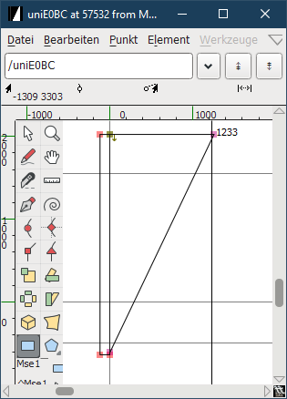

# Meslo LGS NF Regular font for use with Clear-Type font-smoothing

This is a patched version of [romkatv's MesloLGS NF Regular][1] font to
work around [Clear-Type font-smoothing artifacts][2]. This is basically done by
adding a rectangular to the affected side of the glyphs with [FontForge][3]:

Currently patched [glyphs][4] are `E0B0` and `E0BC`.

[1]: https://github.com/romkatv/dotfiles-public/tree/master/.local/share/fonts/NerdFonts
[2]: https://github.com/mintty/mintty/issues/943
[3]: https://fontforge.org
[4]: https://github.com/ryanoasis/powerline-extra-symbols#glyphs
